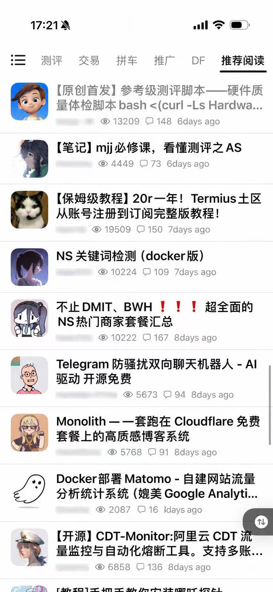
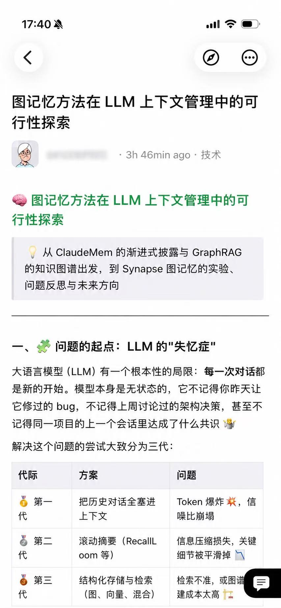
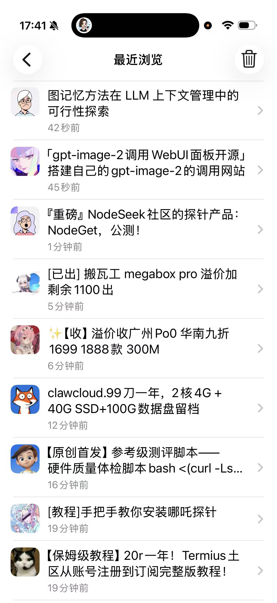

# NodeSeek iOS（TrollStore 版）


NodeSeek iOS 是一个非官方三方 iOS 客户端，使用 UIKit 构建，通过 HTML/XPath 解析提供原生浏览、帖子详情、登录态复用、回复、图片查看和 NodeImage 图片上传等能力。

本项目不隶属于 NodeSeek，也不代表 NodeSeek 官方。用户登录、授权和内容访问均发生在用户自己的 NodeSeek / NodeImage 账号上下文中。

> 最新安装包请到 [Releases](https://github.com/Zeu1s/ns-connect-1.0.7-trollstore/releases/latest) 下载，TrollStore 可直接安装，无需 Apple 开发者证书，也无需 TestFlight。

## 功能

- 浏览 NodeSeek 主题列表、帖子详情和评论。
- 通过 WebView 登录，并在 WebView 与原生请求之间同步用户授权的 Cookie。
- 支持回复、引用、表情和 NodeImage 图片上传（回帖与私信均可）。
- 支持图片预览、保存和分享。
- 全局显示缩放（70% – 120%），列表、详情、私信、主页等页面等比例缩放。
- 首页列表、帖子楼主、回帖作者显示论坛等级、加入天数与头衔徽章（DEV、禁言等）。
- 底部导航、私信页、用户主页移动端布局适配。
- 包含 SwiftPM 逻辑测试和 Xcode app-hosted 测试。

## 截图

<p>
  
  
  
</p>

## 安装（TrollStore）

1. 前往 [Releases](https://github.com/Zeu1s/ns-connect-1.0.7-trollstore/releases/latest) 下载 `NS-Connect-1.0.7-trollstore.ipa`。
2. 将 IPA 发送到 iPhone（AirDrop / 网盘 / 文件 App）。
3. 使用 TrollStore 打开并安装。
4. 首次使用在 App 内登录 NodeSeek，并在设置中完成 NodeImage 图床授权（私信/回帖发图需要）。

## 环境要求

- macOS + Xcode 26 或兼容版本。
- iOS 15+。
- Ruby/Bundler 用于 fastlane 发布流程（可选）。

## 构建

打开主工程：

```bash
open nodeseek.xcodeproj
```

TrollStore IPA 使用 GitHub Actions 构建，无需 Mac：

1. 将本仓库 fork 或推送到你自己的 GitHub 仓库。
2. 打开 **Actions** → **Build TrollStore IPA** → **Run workflow**。
3. 构建完成后下载 `NS-Connect-1.0.7-trollstore-ipa` 工件，解压得到 IPA。

工作流在 macOS 构建机上编译未签名 App，再用 `ldid` 伪签名并打包上传。此流程不需要 Apple Developer 证书；源码不会上传任何账号 Cookie 或密钥。

## 测试

运行纯逻辑测试：

```bash
make spm-test
```

构建 Xcode 测试产物：

```bash
make xcode-build-tests
```

运行指定 XCTest 类：

```bash
make xcode-test-class TEST=NodeSeekServiceTests
```

完整 App 单测：

```bash
make xcode-test-full
```

如本机模拟器 ID 不一致，可覆盖 `SIMULATOR_ID`：

```bash
make xcode-test-class TEST=NodeSeekServiceTests SIMULATOR_ID=<simulator-udid>
```

## 隐私与安全

应用不在源码仓库中保存用户 Cookie、NodeSeek 凭据或 NodeImage API Key。运行时授权信息保存在系统 Cookie/Keychain 等本机存储中，退出登录会清除本机 NodeImage 授权。

如果你发现安全问题，请不要在公开 issue 中贴出账号、Cookie、API Key 或其它敏感信息。

## 许可证

本项目使用 MIT License，见 [LICENSE](LICENSE)。